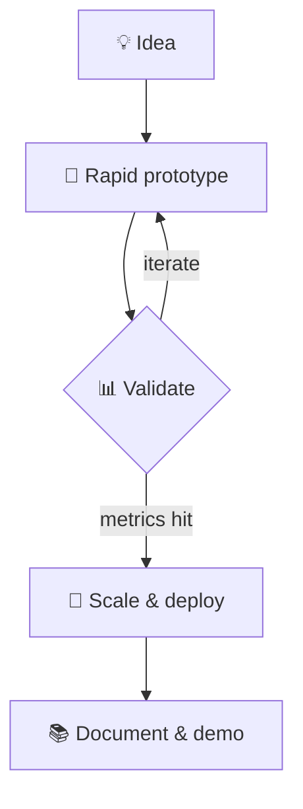

<!-- Profile README: github.com/vrk7/vrk7 -->

<div align="center">
  <h1>🦇 Welcome to Gotham — I'm Vysakh</h1>
  <p>
    <strong>AI • Computer Vision • 3D Graphics</strong><br/>
    Building real-time, camera-aware experiences and practical ML pipelines.
  </p>

  <p>
    <a href="https://github.com/vrk7?tab=followers"></a>
    <a href="https://vrk7.github.io"></a>
    <a href="https://www.linkedin.com/in/vysakh-ramakrishnan/"></a>
  </p>

  
</div>

---

## 🧭 Quick Navigation

<p align="center">
  <a href="#-mission-control">Mission Control</a> •
  <a href="#-toolbox">Toolbox</a> •
  <a href="#-lab-notebook">Lab Notebook</a> •
  <a href="#-stats--status">Stats & Status</a> •
  <a href="#-lets-connect">Let's Connect</a>
</p>

---

## 🚀 Mission Control

<details open>
  <summary><strong>What I'm currently piloting</strong></summary>
  <br/>
  <ul>
    <li>🛰️ Deploying camera-aware AI that fuses vision + geometry.</li>
    <li>🧪 Rapid prototyping practical ML demos with polished UX.</li>
    <li>🛠️ Building reproducible pipelines with CI/CD, docs, and observability.</li>
    <li>🏎️ Shipping code that meets real-time constraints without sacrificing quality.</li>
  </ul>
</details>

<details>
  <summary><strong>How I approach problems</strong></summary>
  <br/>
  <ul>
    <li>🎯 Product-focused research mindset — align metrics with actual user value.</li>
    <li>🧠 Pair cutting-edge models with pragmatic engineering trade-offs.</li>
    <li>🗺️ Architect for iteration: modular components, automated tests, reproducible envs.</li>
    <li>🤝 Collaborative by default — clear documentation, async-friendly communication.</li>
  </ul>
</details>

---

## 🧰 Toolbox

<p align="center">
  
</p>

<table>
  <tr>
    <td>
      <h3>🧱 Core Stack</h3>
      <ul>
        <li>Python + PyTorch for model training and deployment.</li>
        <li>Unity & Three.js for spatial/AR graphics.</li>
        <li>TypeScript, React, and WebGL for interactive frontends.</li>
      </ul>
    </td>
    <td>
      <h3>⚙️ Ops & DX</h3>
      <ul>
        <li>Dockerized pipelines with Makefiles + GitHub Actions.</li>
        <li>Monitoring with Weights & Biases, Prometheus, Grafana.</li>
        <li>CI/CD for inference services and web experiences.</li>
      </ul>
    </td>
  </tr>
</table>

---

## 🧪 Lab Notebook

<table>
  <tr>
    <td width="50%">
      <h3>📸 Spatial Vision</h3>
      <ul>
        <li>Instant AR overlays using depth-aware segmentation.</li>
        <li>3D pose pipelines for sports & motion analytics.</li>
        <li>NeRF-based scene capture experiments for digital twins.</li>
      </ul>
    </td>
    <td width="50%">
      <h3>🤖 Applied ML</h3>
      <ul>
        <li>Edge-ready detectors optimized with TensorRT.</li>
        <li>LLM agents orchestrating computer vision tasks.</li>
        <li>Evaluation harnesses with synthetic + real datasets.</li>
      </ul>
    </td>
  </tr>
</table>

<details>
  <summary><strong>Peek into my workflow (click to expand)</strong></summary>


</details>

---

## 📈 Stats & Status

<div align="center">
  
  <br/>
  
  <br/>
  
</div>

<details>
  <summary><strong>Contribution Snake & Trophy Case</strong></summary>
  <br/>
  <p align="center">
    <picture>
      <source media="(prefers-color-scheme: dark)" srcset="https://raw.githubusercontent.com/Platane/snk/output/github-contribution-grid-snake-dark.svg?user=vrk7" />
      <source media="(prefers-color-scheme: light)" srcset="https://raw.githubusercontent.com/Platane/snk/output/github-contribution-grid-snake.svg?user=vrk7" />
      
    </picture>
    <br/>
    
  </p>
</details>

---

## 🎮 Easter Egg

```bash
> ./whoami
🦇 Vysakh — Engineer of Vision
⚡ Loves: fast code, clean design, clever hacks
🎯 Mission: make AI practical & real-time
```

---

## 🤝 Let's Connect

- 💼 Portfolio: <a href="https://vrk7.github.io" target="_blank" rel="noopener noreferrer">vrk7.github.io</a>
- 💬 DM me on <a href="https://www.linkedin.com/in/vysakh-ramakrishnan/" target="_blank" rel="noopener noreferrer">LinkedIn</a>

---

<p align="center">"Make it real-time, make it reliable, make it delightful."</p>
