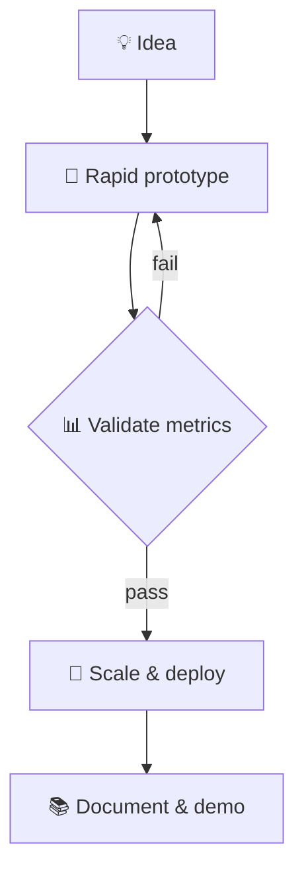

<!-- Profile README: github.com/vrk7/vrk7 -->

  

---

## About Me

I build production-grade AI systems — from real-time computer vision to LLM-powered pipelines. I work across the full stack: model research, backend services, and interactive 3D frontends.

- Engineering camera-aware AI that fuses **vision + geometry**
- Shipping **real-time pipelines** that meet latency constraints without sacrificing reliability
- Prototyping with **LLM agents**, NeRF, and edge-optimized inference
- Code for humans first: modular, tested, documented

---

## Tech Stack

**AI / ML**

**Full Stack**

**3D / Spatial**

**Infra / DevOps**

---

## GitHub Stats

  
  

  

 

  

 

  

---

## Work Areas

<table>
  <tr>
    <td width="50%">
      <h3>Spatial Vision</h3>
      <ul>
        <li>AR overlays with depth-aware segmentation</li>
        <li>3D pose pipelines for sports & motion analytics</li>
        <li>NeRF scene capture for digital twins</li>
      </ul>
    </td>
    <td width="50%">
      <h3>Applied ML</h3>
      <ul>
        <li>Edge detectors optimized with TensorRT</li>
        <li>LLM agents orchestrating vision tasks</li>
        <li>Evaluation harnesses with synthetic + real data</li>
      </ul>
    </td>
  </tr>
</table>

  
<strong>Engineering Workflow</strong>

   

```mermaid
flowchart TD
  A[💡 Idea] --> B[🔬 Rapid prototype]
  B --> C{📊 Validate metrics}
  C -- pass --> D[🚀 Scale & deploy]
  C -- fail --> B
  D --> E[📚 Document & demo]
```

  
<strong>Contribution Snake</strong>

   
  

    <picture>
      <source media="(prefers-color-scheme: dark)" srcset="https://raw.githubusercontent.com/Platane/snk/output/github-contribution-grid-snake-dark.svg?user=vrk7" />
      <source media="(prefers-color-scheme: light)" srcset="https://raw.githubusercontent.com/Platane/snk/output/github-contribution-grid-snake.svg?user=vrk7" />
      
    </picture>
  

---

## Connect

  
  &nbsp;
  
  &nbsp;
  

 

<em>"Make it real-time, make it reliable, make it delightful."</em>

